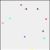

 ## ToDoList App
 
<pre>   

ToDolist app is built with React.

Formik is a small library that can help you with the three most annoying aspects of creating forms in React:

Getting values in and out of the form state
Validation and error messages
Handling form submission
By collecting all of the above in one place, Formik can keep things organized, making testing, refactoring, and reasoning your forms much easier.

Stack Used to build this app: CSS, HTML, JavaScripts, React

</em>
 </pre> 

## Table of Contents 

* [Installation](#installation)
* [Prerequisites](#prerequisites)
* [Improvements](#improvements)
* [Technologies](#technologies)
* [Github Stats and License](#stats) 

## Installation:
>
>This application is compatible with the most commonly used web browsers.
>
>Quick Start:
> * git clone https://github.com/login
> * cd login    
> * npm install
> * npm start
>
>Script Description:
> * cd command use to change the path to the login files folder
> * npm start command starts webpack development server @ localhost:3000
>
> *Fork a repo:
>A fork is a copy of a repository. Forking a repository allows you to freely experiment with changes without affecting the original project.
> [How to Fork? Click here for the Instructions](https://docs.github.com/en/get-started/quickstart/fork-a-repo)
>
>

## Prerequisites:
* install formik
* install Email-Validator
* install React
 
## Contact:  
 
- <a href="mailto:nileemashah@yahoo.com">Email Me </a>

- <a href="https://www.linkedin.com/feed/"> Connect Me </a> 

- <a href="https://github.com/NileemaS/NileemaS.github.io/blob/main/README.md">README for Bio </a>

## Improvements:

Future Improvements to add in the Login App
* Add link to Password forgot and Create new account
* Allow to login with google account
* Try Firebase free app

## Technologies:

    
    
    
    
    

 

  

    
  
## Stats:

 

### License ([^note]) 

[^note]:
    Copyrights @2022, All rights are reserved    
